# Hacker House Voice RAG Architecture

This is the source architecture document for the public interactive diagram at
[`/architecture.html`](frontend/public/architecture.html). The deployed frontend
serves that page from its static public assets.

## Production system map

```mermaid
flowchart LR
  subgraph EDGE[EXPERIENCE / EDGE]
    U[User\nvoice or text] --> FE[Vercel\nReact + Vite]
    FE -->|HTTPS /api| API[Railway\nFastAPI service]
  end
  subgraph RUN[RESEARCH RUNTIME / ONE REQUEST]
    API --> STT[ElevenLabs STT\nvoice input only]
    API --> H[ResearchHarness\nsingle orchestration seam]
    STT --> H
    H --> G[QueryGuard\nsafety + privacy + scope]
    G --> GR[Optional bounded graph\nfixed research workflow]
    GR --> RET[Hybrid retrieval\ndense + lexical]
    RET --> EMB[Multilingual E5\n384-dim query embedding]
    EMB --> Q[(Qdrant\nvoice_rag_active alias)]
    Q --> CTX[Context fit\nscore floor + char budget]
    CTX --> MODE{Answer mode}
    MODE -->|fast| FAST[Local extractive\npassage answer]
    MODE -->|normal| LLM[OpenCode\nhosted generator]
    FAST --> VAL[Grounding validation\ncitation IDs + overlap]
    LLM --> VAL
    VAL --> OUT[Grounded JSON\nor SSE events]
    OUT --> FE
  end
  subgraph KNOW[KNOWLEDGE / INDEXING PLANE]
    DATA[MSMARCO-XI +\ncurated Goa corpus] --> IW[Python 3.11\nindex worker / CLI]
    IW --> IE[Chunk + embed\nnative + English copies]
    IE --> QC[Versioned Qdrant\ncollection]
    QC --> CHECK[Validate\ncounts + dimensions]
    CHECK --> PROMOTE[Atomic alias promotion\nvoice_rag_active]
    PROMOTE --> Q
  end
  subgraph TOOLS[OPTIONAL READ-ONLY TOOLS]
    J[Jina Reader]
    FC[Firecrawl]
  end
  GR -.->|only when enabled| J
  GR -.->|only when enabled| FC
  J -.-> CTX
  FC -.-> CTX
  subgraph OPS[LLM OPS / OPERATIONS]
    TRACE[TraceSink\nprivacy-safe JSONL] --> PG[(Supabase PostgreSQL\nquery traces + index metadata)]
    H --> TRACE
    EVAL[Evaluation + latency\nrefusal + grounding gates] --> REL[Release record\nmodel / prompt / index version]
    PG --> EVAL
    REL --> IW
  end
  MEM[Memory boundary\nno personal conversational memory in v1\nshared RAG knowledge only]
  MEM -.-> H
```



## Runtime flow

1. The browser sends text or recorded audio from Vercel to the Railway API.
2. Audio is transcribed by ElevenLabs. The query guard then rejects unsafe,
   privacy-sensitive, or out-of-scope requests before retrieval.
3. `ResearchHarness` retrieves from the promoted Qdrant alias using multilingual
   E5 embeddings and lexical matching, then applies score and context budgets.
4. Fast mode returns a relevant local passage. Normal mode asks the hosted
   generator to answer only from the retrieved evidence.
5. Citation IDs and answer/evidence overlap are checked before JSON or SSE is
   returned. Query and index metadata are recorded best-effort in PostgreSQL.

## Planes and boundaries

- **Experience/edge:** Vercel serves the React/Vite interface. `VITE_API_URL`
  points requests at the Railway deployment.
- **Research runtime:** FastAPI, `QueryGuard`, `ResearchHarness`, retrieval,
  answer providers, and grounding validation run in the Railway container.
- **Knowledge/retrieval:** MSMARCO-XI and the curated Goa corpus are chunked and
  embedded by the Python 3.11 index worker. A versioned collection is validated
  for counts and dimensions before the `voice_rag_active` alias is promoted.
- **Tools:** Jina Reader and Firecrawl are optional, read-only research tools.
  They are not memory stores and do not write to the application database.
- **LLMOps/operations:** privacy-safe JSONL traces, PostgreSQL metadata,
  evaluation results, latency/refusal/grounding gates, and model/prompt/index
  release versions form the feedback and promotion loop.
- **Memory boundary:** Qdrant is retrieval memory for the shared corpus, and
  PostgreSQL is operational history. This v1 release has no personal
  conversational memory, user profile memory, or long-term chat state.

## Deployment topology

```text
Vercel (frontend)
  └── HTTPS /api → Railway (Dockerized FastAPI)
        ├── Qdrant Cloud (versioned vectors + voice_rag_active alias)
        ├── Supabase PostgreSQL (traces + ingestion metadata)
        ├── ElevenLabs (speech-to-text, voice requests)
        └── OpenCode (normal-mode hosted generation)
```

The serving path can answer in fast mode without a hosted LLM. PostgreSQL
degradation is observable and does not need to take down query serving; Qdrant
availability and an active production alias remain essential for grounded
production retrieval.
