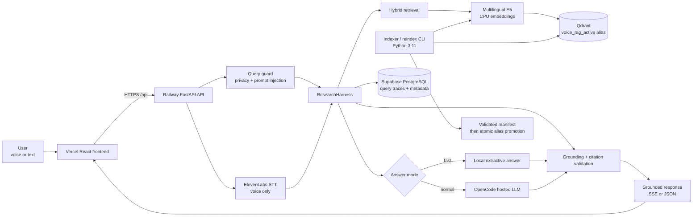

# Hacker House Voice RAG Architecture

This is the source architecture document for the public interactive diagram at
[`/architecture.html`](frontend/public/architecture.html). The deployed frontend
serves that page from its static public assets.

## Runtime flow

1. The browser sends text or recorded audio to the Railway API.
2. Audio is transcribed by ElevenLabs, then the query guard blocks unsafe or
   irrelevant requests before retrieval.
3. The harness retrieves from the promoted Qdrant alias using multilingual E5
   embeddings and hybrid lexical matching.
4. Fast mode quotes a relevant passage locally. Normal mode asks the hosted
   generator to answer from the retrieved evidence.
5. Citation IDs and answer/evidence overlap are checked before the response is
   returned. Query metadata is written best-effort to PostgreSQL.

## Deployment and data flow

- Vercel hosts the frontend and uses `VITE_API_URL` to reach Railway.
- Railway runs the Dockerized FastAPI service and honors its injected `PORT`.
- Qdrant is an external vector store. The `voice_rag_active` alias currently
  points to the curated production collection.
- Supabase PostgreSQL stores operational traces and ingestion metadata. Database
  persistence is optional for serving, but the DSN must resolve for it to work.
- Index builds write a versioned collection, validate it, and promote the alias
  atomically so queries do not see a partial index.
