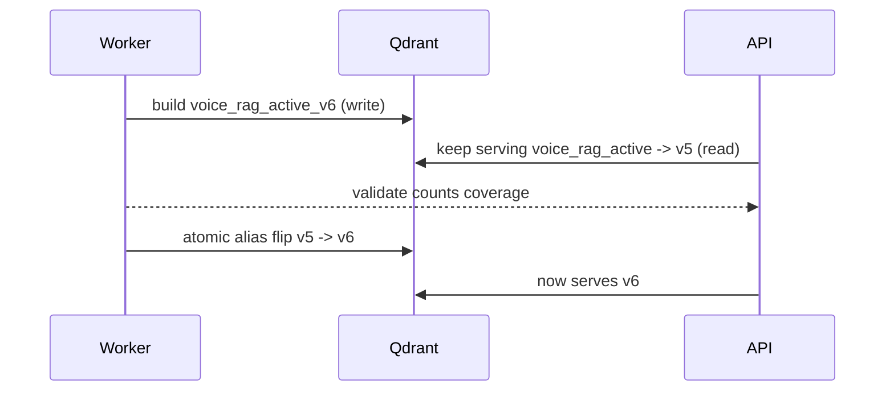

# Deployment & Index Migration Runbook

Everything needed to (re)index, feed new data, and migrate the Voice RAG stack
to production with **zero downtime** and **one-command rollback**.

---

## 1. Quick reference

| You want to... | Command |
|---|---|
| See current index status | `make index-status` |
| Rebuild + promote everything (new auto version) | `make reindex` |
| Quick validation slice (100 rows, all 14 langs) | `make reindex-slice` |
| Rebuild one language | `make reindex-language LANG=hi` |
| Rebuild with explicit version | `make reindex-version VERSION=prod-20260822-1` |
| Feed a local custom corpus file | `make ingest INPUT=data/mydata.jsonl LANGUAGE=en OUTPUT=data/chunks-custom.jsonl` then `voice-rag-reindex` |
| Promote an existing built version | `make index-promote VERSION=v6` |
| Roll back the active index | `make index-rollback VERSION=v5` |
| Run the eval benchmark | `make evaluate QUERIES=evals/dataset.jsonl` |

All of the above go through `voice-rag-reindex` (see `src/voice_rag/reindex_cli.py`).

---

## 2. How versioned indexing works (safe by design)

1. The worker builds a **new, versioned Qdrant collection**
   (`voice_rag_active_<version>`) while the API keeps serving from the
   previously promoted collection — **no downtime**.
2. On success it validates point counts + language coverage; only then does it
   atomically flip the `voice_rag_active` alias to the new collection
   (single `update_collection_aliases` call, so there is never a "no alias" window).
3. Builds are **idempotent and resumable**: deterministic point IDs, so
   re-running a version resumes from completed language entries without
   duplicates. Manifests live in `data/manifests/<version>.json`.
4. Failed validation → **not promoted**: the old version stays live.



---

## 3. Daily / change workflows

### 3.1 "I changed the RAG" (chunking / embedding / prompt)
```bash
make infra-up
make postgres-init
make reindex-slice          # 1) validate the change end-to-end fast
make reindex                # 2) full rebuild + auto-promote
make index-status           # 3) confirm new version is active
make evaluate QUERIES=evals/dataset.jsonl   # 4) check latency/quality
```

### 3.2 "I have new data to feed" (custom corpus)
```bash
# 1. Convert raw rows to chunks (JSONL with text + metadata)
.venv311/bin/voice-rag-ingest --input data/mydata.jsonl --language en \
    --output data/chunks-custom.jsonl
# 2. Rebuild + promote (or just re-run a manifest-resumable version)
make reindex
```

### 3.3 "Oops — the new index is bad" (rollback)
```bash
make index-rollback VERSION=v5   # alias points back to v5 instantly
make index-status                # confirm
```
Rollback is a single alias operation — microseconds, no reprocessing.

---

## 4. Production deploy (Docker)

```bash
cp .env.prod.example .env.prod
#   edit .env.prod: real DATABASE_URL, QDRANT_URL, QDRANT_API_KEY,
#   OPENCODE_GO_API_KEY, ELEVENLABS_API_KEY (never commit these)

# One-time DB init
docker compose -f docker-compose.prod.yml --env-file .env.prod \
    --profile init run --rm postgres-init

# Full stack up (qdrant + postgres + api)
docker compose -f docker-compose.prod.yml --env-file .env.prod up -d

# Health
curl http://<server>:8000/api/health
#   expect: {"status":"ok","dependencies":{"api":"ok","qdrant":"configured",...}}

# Run one-off indexing inside the worker container:
docker compose -f docker-compose.prod.yml --env-file .env.prod \
    exec worker voice-rag-reindex --all
docker compose -f docker-compose.prod.yml --env-file .env.prod \
    exec worker voice-rag-reindex --status
```

For a fresh hosted Qdrant cluster, seed the reviewed Hacker House corpus first:

```bash
set -a; source .env.prod; set +a
.venv311/bin/voice-rag-reindex --curated-only --version prod-curated-1 --no-semantic
```

The command creates a 384-dimensional `voice_rag_active_prod-curated-1` collection,
writes the curated vectors and payloads, validates it, and promotes the
`voice_rag_active` alias. Full MSMARCO-XI indexing requires `HF_TOKEN`, Python 3.11,
and substantially more storage.

Notes:
- `REQUIRE_ACTIVE_INDEX=true` in production → API refuses (HTTP 503) until a
  validated index is promoted. No silent demo mode.
- Qdrant + Postgres volumes persist across restarts; backing them up is your
  durability story.
- Secrets: use a secret manager (AWS Secrets Manager / Vault / Docker secrets)
  instead of a committed `.env.prod` for real deployments.

## 4.1 One-click hosted API deploy (Render)

The repository includes [`render.yaml`](render.yaml), so it can be deployed as a
Render Blueprint from the repository's **New > Blueprint** flow. Render builds the
Docker image and uses `/api/health` as the readiness check. The Blueprint asks for
the secret values instead of storing them in Git.

Set these secret variables when Render prompts for them:

- `DATABASE_URL`: the Supabase **Session pooler** connection string from Connect,
  with any `@` in the password encoded as `%40`. Use the pooler host
  (`*.pooler.supabase.com`), not the direct `db.<project-ref>.supabase.co` host,
  because Railway environments commonly have no IPv6 route to the direct host.
- `QDRANT_URL` and `QDRANT_API_KEY`: the production Qdrant endpoint and key.
- `OPENCODE_GO_API_KEY`: required for FULL mode.
- `ELEVENLABS_API_KEY`: required for voice input.

After deployment, verify:

```bash
curl https://<render-service>.onrender.com/api/health
```

It must report `qdrant: configured`. Because production is fail-closed, HTTP 503
until the `voice_rag_active` alias exists is expected and means the index must be
promoted in the production Qdrant cluster.

Finally add this environment variable to the existing Vercel project and redeploy
the frontend:

```text
VITE_API_URL=https://<render-service>.onrender.com
```

The frontend source already uses this value for health, benchmark, and streaming
query requests. The backend's `CORS_ORIGINS` is preconfigured for
`https://hh-goa-voice-olive.vercel.app`.

### 4.2 Railway checklist

Railway uses the repository `Dockerfile` and [`railway.toml`](railway.toml). Set
the same runtime variables in the Railway service's Variables tab; Railway does
not automatically read a local `.env.prod` file from your computer. At minimum:
`APP_ENV=production`, `REQUIRE_ACTIVE_INDEX=true`, `QDRANT_URL`,
`QDRANT_API_KEY`, `QDRANT_COLLECTION=voice_rag_active`, and `DATABASE_URL`
(the legacy `POSTGRES_DSN` name is also accepted),
`OPENCODE_GO_API_KEY`, `ELEVENLABS_API_KEY`, and `CORS_ORIGINS`.

The runtime image includes `sentence-transformers` because the API must load the
same multilingual embedding model used to build the Qdrant collection.

At the time of the last production check, Qdrant was healthy with 84 curated
vectors and the active alias was promoted. The supplied Supabase hostname did
not resolve in a direct connection test, so PostgreSQL trace persistence will
remain unavailable until the DSN uses the actual Supabase host from the project
dashboard. Query serving itself remains independent of the optional trace write.

---

## 5. Roll-forward vs roll-back strategy

- **Roll-forward:** build a new version with the fix, `make reindex`, promote.
  Zero downtime; old version remains available in the manifests for N days.
- **Roll-back:** `make index-rollback VERSION=<previous>` — instant alias flip.
- Keep at least the last 2–3 manifests (`data/manifests/*.json`) so any version
  can be re-promoted or resumed.

---

## 6. Storage budget warning

The full MSMARCO-XI corpus is ~55.6 GB before embeddings. Do **not** run a full
`make reindex` on a 154 GB dev disk. Use:
- `make reindex-slice` locally (validation path only), or
- a production server with ≥400 GB free disk + adequate RAM for the embed batch.

---

## 7. Monitoring

- API health: `GET /api/health` (status + dependency health + active index version).
- Query traces: `data/traces.jsonl` + `query_traces` table (privacy-safe).
- Eval gate: `make evaluate QUERIES=evals/dataset.jsonl` before every promotion
  in production.
